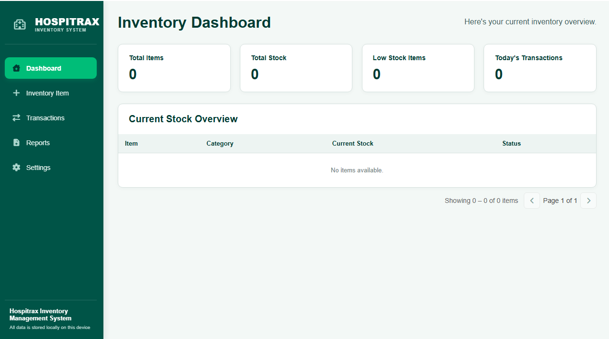
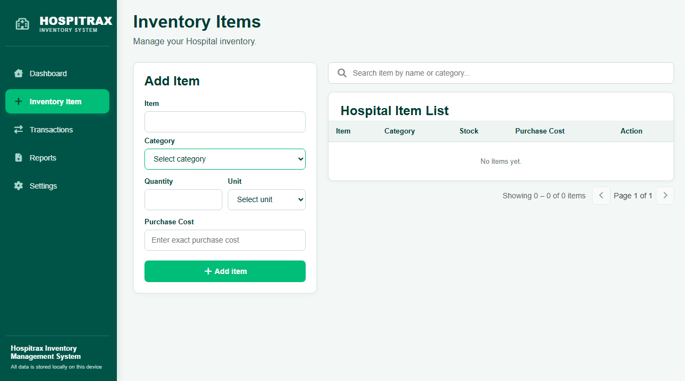
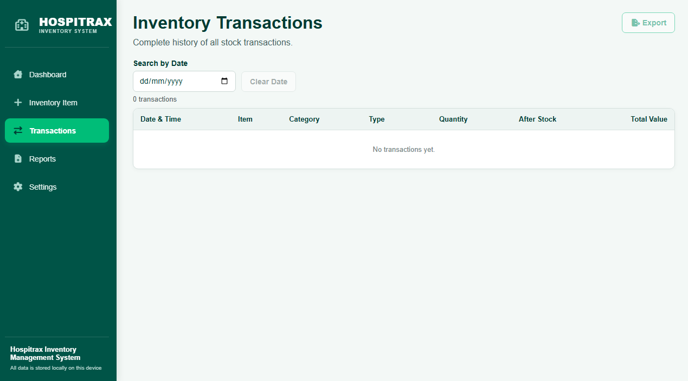
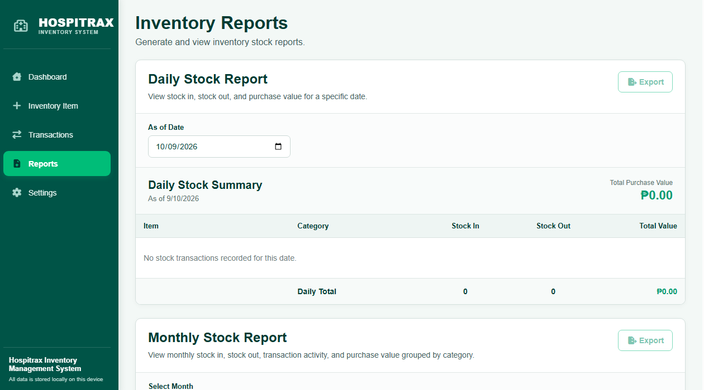
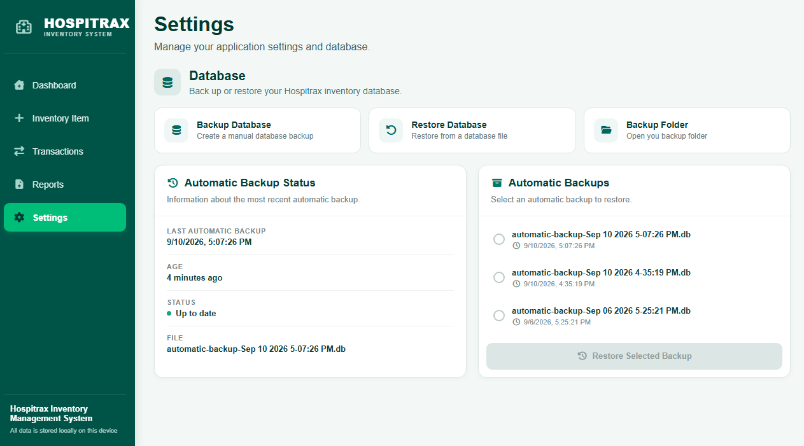

Hospitrax — Hospital Inventory Management System

An offline desktop application for managing hospital inventory — built to give small clinics and hospital departments a simple, reliable way to track supplies without needing an internet connection or a dedicated IT team.

Overview

Hospitrax runs entirely offline, storing all data locally so hospital staff can manage inventory even without a stable internet connection. It was built as a personal project to explore full-stack desktop development using modern web technologies packaged into a native Windows application.

Download

The latest packaged Windows installer is available on the Releases page — no setup required, just download Hospitrax.Setup.1.0.0.exe and run it.

Features
Inventory Management — Add, update, and monitor hospital supplies in real time
Stock IN/OUT Transactions — Record incoming and outgoing stock movements
Daily and Monthly Reports — Generate inventory reports for auditing and planning
Database Backup and Restore — Protect against data loss with manual backup/restore
Automatic Database Backups — Scheduled backups run without manual intervention
Inventory Export — Export inventory data for external use
Offline-First — No internet connection required; all data stays local
Tech Stack
Layer	Technology
UI	React
Desktop Runtime	Electron
Database	SQLite (via better-sqlite3)
Packaging	electron-builder
Version Control	Git / GitHub
Database Design

Hospitrax uses a relational SQLite database with a 3-table schema designed to keep inventory records accurate, consistent, and easy to query for reporting.

Source Code

The full Hospitrax codebase (including the React UI) is maintained in a private repository. This public repository includes selected backend/Electron source files — the database layer, IPC handlers, and Electron process setup — to demonstrate implementation approach and code style.

Included Files
File	Purpose
electron/main.js	Electron main process setup — window creation and app lifecycle
electron/preload.cjs	Secure context bridge between Electron's main and renderer processes
electron/database.js	SQLite connection setup and schema initialization
electron/ipc/stockTransactions.js	IPC handlers for recording and managing stock IN/OUT transactions
electron/ipc/backup.js	Database backup, restore, and automatic-backup logic

Feel free to reach out if you'd like to discuss the full implementation in more detail.

Screenshots

Dashboard:

Inventory Item Management:

Stock Transactions:

Reports:

Settings:

Project Status

This is a personal project built to strengthen hands-on skills in desktop application development, relational database design, and offline-first architecture. Version 1.0.0 is the initial production release. Feedback and suggestions are welcome.

Author

Ivan Adrian M. Valdez GitHub · ivanadrianvaldez7@gmail.com